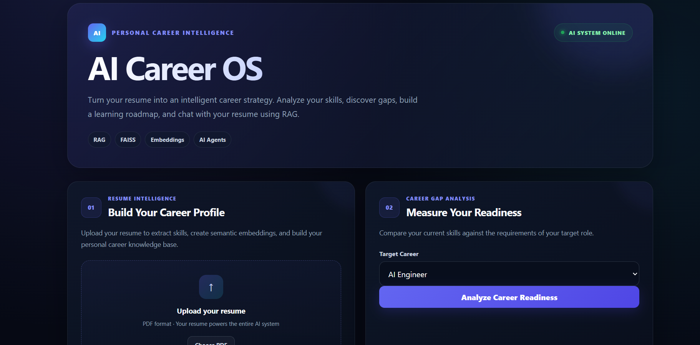
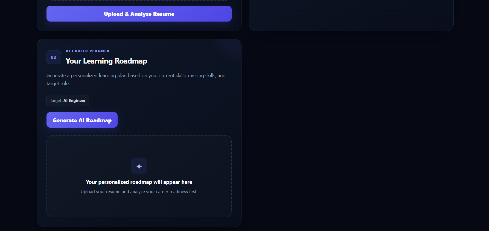
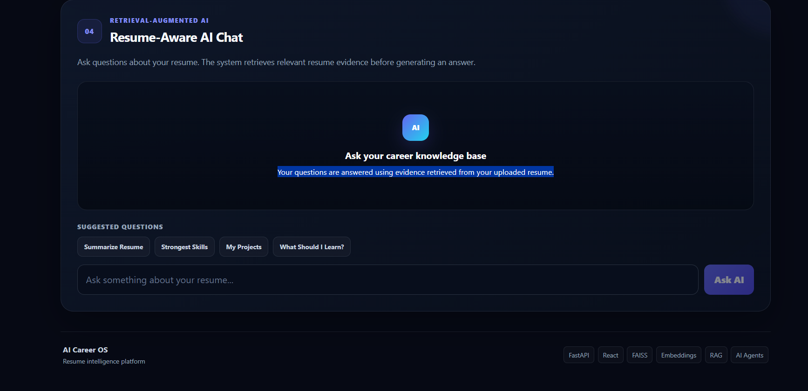

# AI Career OS

AI Career OS is an AI-powered career intelligence platform that analyzes a user's resume, identifies skill gaps, generates personalized learning roadmaps, and provides resume-aware AI conversations.

## Live Demo

Frontend:
https://ai-career-2j4jhqiaz-manus-projects-696460a1.vercel.app

Backend API:
https://ai-career-os-2.onrender.com

API Documentation:
https://ai-career-os-2.onrender.com/docs

---

## Features

### Resume Intelligence
- Upload PDF resumes
- Extract resume text
- Automatically detect technical skills
- Build a searchable resume knowledge base

### Career Gap Analysis
- Select a target career role
- Calculate career readiness
- Identify missing skills
- Recommend areas for improvement

### AI Roadmap
- Generate personalized learning roadmaps
- Adapt recommendations to the user's current skills
- Focus on target-role requirements

### Resume-Aware AI Chat
- Ask questions about your resume
- Retrieve relevant resume evidence
- Generate contextual AI responses

### Multi-Agent Career Intelligence
- Researcher
- Analyst
- Critic
- Planner
- Orchestrator

---

##  Architecture

```text
                    React Frontend
                         │
                         ▼
                    FastAPI API
                         │
          ┌──────────────┼──────────────┐
          │              │              │
          ▼              ▼              ▼
    Resume Parser   Career Engine   Agent System
          │
          ▼
      Text Chunks
          │
          ▼
      TF-IDF Vectors
          │
          ▼
        FAISS
          │
          ▼
   Relevant Resume Evidence
          │
          ▼
       Groq LLM
          │
          ▼
     AI Career Response

Tech Stack:

Frontend
React
Vite
JavaScript
CSS
Backend
Python
FastAPI
Uvicorn
AI / RAG
Groq API
TF-IDF vectorization
FAISS
Retrieval-Augmented Generation
Document Processing
PyPDF
Deployment
Vercel
Render

API Endpoints:

Endpoint	Method	Purpose
/	GET	API status
/health	GET	Health check
/upload	POST	Upload and process resume
/analyze	GET	Career gap analysis
/ai-analysis	GET	AI resume analysis
/roadmap	GET	Generate learning roadmap
/retrieve	GET	Retrieve resume evidence
/chat	GET	Resume-aware AI chat
/career-team	GET	Multi-agent career analysis

Local Development:

Backend
cd backend

python -m venv venv

# Windows
venv\Scripts\activate

pip install -r requirements.txt

uvicorn main:app --reload

Backend:

http://127.0.0.1:8000

Swagger:

http://127.0.0.1:8000/docs
Frontend
cd frontend

npm install

npm run dev
Environment Variables:

Create a .env file inside backend:

GROQ_API_KEY=your_api_key_here

Never commit .env to GitHub.

Deployment:
Backend

Deployed using Render.

Start command:

uvicorn main:app --host 0.0.0.0 --port $PORT
Frontend

Deployed using Vercel.

Build command:

npm run build

Output directory:dist

Current Limitations:

Resume/vector data is currently stored in memory.
The current implementation is optimized as a lightweight MVP.
Authentication is not yet implemented.
Persistent database storage is not yet implemented.
Multi-user isolation is not yet implemented.

Future Improvements:

User authentication
PostgreSQL database
Persistent vector database
Cloud resume storage
Multi-user sessions
Job-description matching
Resume scoring
Application tracking
Interview preparation agent
Persistent career history

Author:

MANOHAR

Built as an end-to-end GenAI engineering project demonstrating:

RAG + LLM APIs + FAISS + Multi-Agent Systems + FastAPI + React + Cloud Deployment

##  Screenshots

### Dashboard


### Api-endpoints


### Roadmap


### AI Career Chat



## Architecture diagram

                    ┌──────────────────────┐
                    │   React / Vite UI    │
                    │       Vercel         │
                    └──────────┬───────────┘
                               │ HTTPS
                               ▼
                    ┌──────────────────────┐
                    │     FastAPI API      │
                    │       Render         │
                    └──────────┬───────────┘
                               │
              ┌────────────────┼────────────────┐
              ▼                ▼                ▼
       ┌────────────┐   ┌─────────────┐  ┌─────────────┐
       │ PDF Parser │   │ Skill Engine│  │ Career      │
       │   PyPDF    │   │             │  │ Analysis    │
       └──────┬─────┘   └─────────────┘  └─────────────┘
              │
              ▼
       ┌──────────────┐
       │ Text Chunks  │
       └──────┬───────┘
              ▼
       ┌──────────────┐
       │ Vector Store │
       │    FAISS     │
       └──────┬───────┘
              │
              ▼
       ┌──────────────┐
       │ RAG Retrieval│
       └──────┬───────┘
              │
              ▼
       ┌──────────────┐
       │   Groq LLM   │
       └──────┬───────┘
              │
              ▼
       ┌──────────────┐
       │ AI Response  │
       └──────────────┘